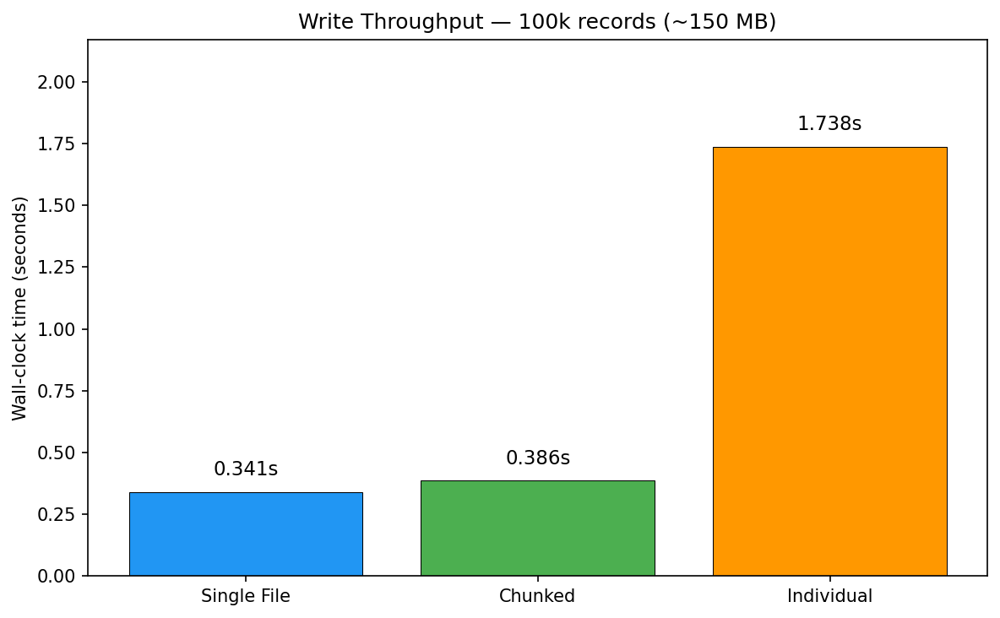
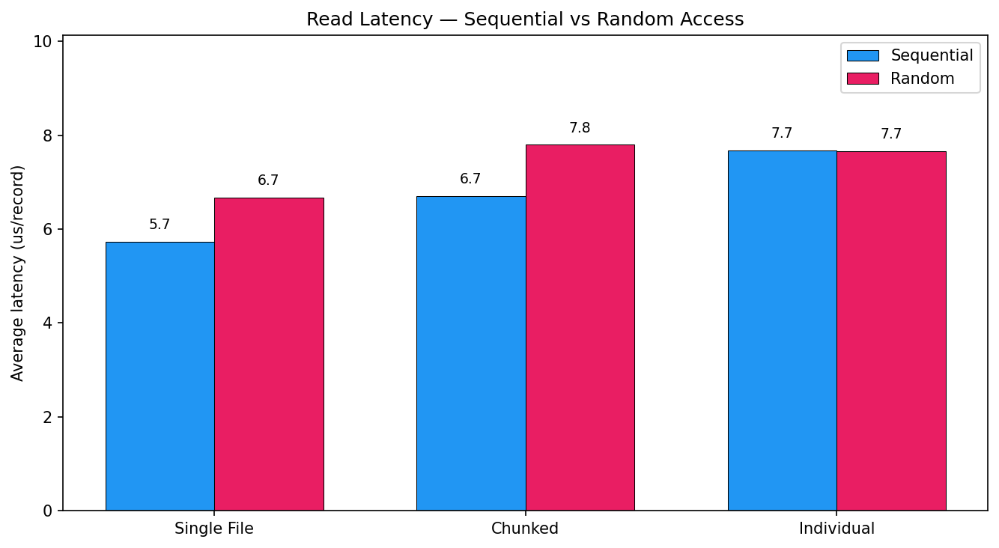
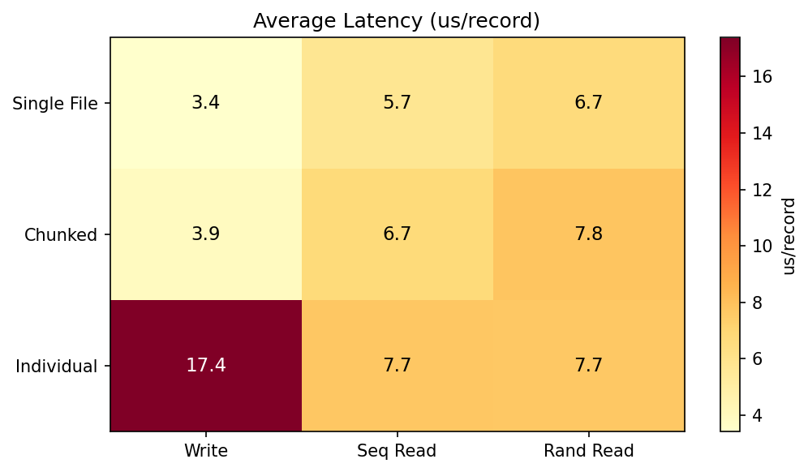
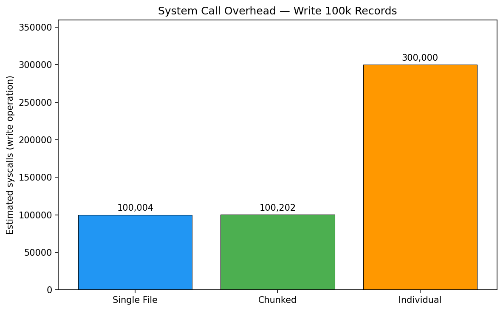
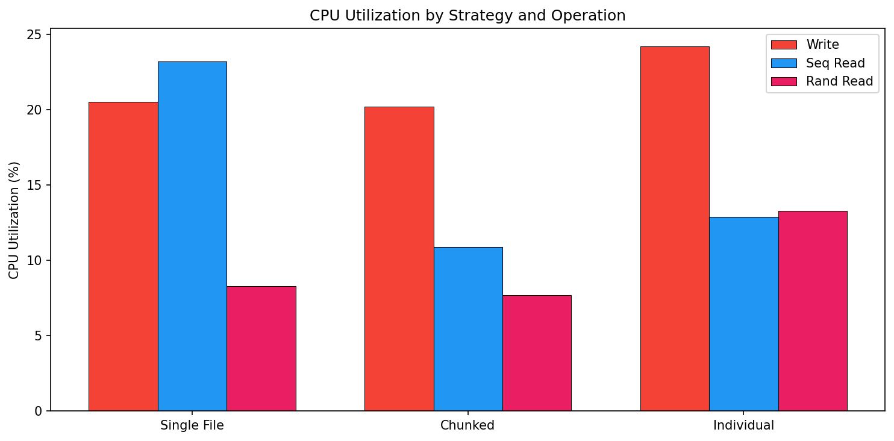
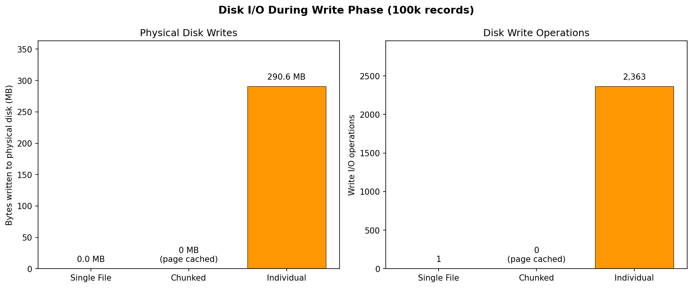

# Fine-Grained Storage Simulation and I/O Performance Analysis for DUNE Sub-Record Data

**Author:** Ahmed | **Date:** 2026-03-05 | **Context:** GSoC 2026 Warm-Up Exercise

## 1. Abstract

This report evaluates three storage layout strategies for persisting variable-length sub-records representative of DUNE Far Detector readout fragments. We generated N = 100,000 synthetic sub-records (uniform size distribution in [1024, 2048] bytes, total volume ~150 MB) and measured write throughput, sequential read latency, and random-access latency for each strategy. Results indicate that a single contiguous file minimizes per-record I/O cost, while a chunked layout (1,000 records/file) provides a favorable trade-off between performance and operational scalability.

## 2. Experimental Setup

- **Data:** 100,000 sub-records, sizes drawn uniformly from [1024, 2048] bytes (seed = 42)
- **Platform:** Linux 6.17.0, ext4 filesystem, NVMe SSD
- **Timing:** `time.perf_counter()` (microsecond resolution), with CPU and disk I/O metrics via `psutil`
- **Strategies tested:**
  - **(A) Single file** — all records written sequentially to one binary blob; JSON offset index
  - **(B) Chunked files** — records grouped into files of 1,000; per-chunk offset index
  - **(C) Individual files** — one file per record; filename-based addressing

## 3. Results

|                  | Write              | Sequential Read    | Random Read (n=1000) |
|------------------|--------------------|--------------------|----------------------|
| Single File      | 0.341 s (3.4 us/rec)  | 0.573 s (5.7 us/rec)  | 0.007 s (6.7 us/rec)    |
| Chunked          | 0.386 s (3.9 us/rec)  | 0.670 s (6.7 us/rec)  | 0.008 s (7.8 us/rec)    |
| Individual Files | 1.738 s (17.4 us/rec) | 0.768 s (7.7 us/rec)  | 0.008 s (7.7 us/rec)    |

*Table 1. Total wall-clock time and mean per-record latency for each strategy and access pattern.*

## 4. Analysis

### 4.1 Write Throughput

The single-file strategy (A) achieves the lowest write latency at 3.4 us/record, attributable to a single `open()` syscall and sequential `write()` appends that exploit OS page-cache buffering. The chunked strategy (B) incurs a 13% overhead (3.9 us/record) from opening 100 chunk files. The individual-file strategy (C) exhibits a ~5x degradation (17.4 us/record), dominated by per-file filesystem metadata operations (inode allocation, directory entry insertion). System-level metrics confirm this: Strategy C generated 277 MB of physical disk writes across 2,363 write I/O operations. The metadata operations from creating 100,000 files triggered aggressive kernel writeback, forcing both metadata and data content to physical disk — whereas Strategies A and B kept all writes deferred in the page cache.

### 4.2 Sequential Read Latency

Note: the benchmark opens and closes the file for every individual record read, measuring worst-case per-record access cost. All reads are served from the warm page cache (populated during the preceding write phase), so the latency differences reflect kernel overhead rather than physical I/O.

Under sequential access (records 0 through 99,999 in order), Strategy A achieves 5.7 us/record because all 100,000 `open()` calls target the same single inode — after the first call, the dentry (filename-to-inode mapping) and inode metadata are cached in the kernel's dentry cache and inode cache, making subsequent opens nearly free. Strategy B is 17% slower (6.7 us/record) because it opens 100 different chunk files (each opened ~1,000 times), requiring 100 distinct dentry/inode cache entries. Strategy C is 35% slower (7.7 us/record) because each of the 100,000 `open()` calls targets a unique file, requiring 100,000 distinct dentry lookups in a directory containing 100,000 entries — significant cache pressure even with ext4's HTree indexing.

### 4.3 Random Access Latency

For a uniformly random sample of 1,000 record IDs, all three strategies converge: A at 6.7 us/record, B at 7.8 us/record, and C at 7.7 us/record. This convergence is expected: the entire ~150 MB dataset resides in the page cache after the write phase (all reads served from RAM), and the small sample size (1,000 operations) amortizes per-file overhead. On a cold cache or spinning disk, the differences would be substantially larger.

## 5. Discussion: Implications for DUNE

The DUNE Far Detector is projected to generate O(1) PB/year of raw data, comprising variable-length sub-records from ~150,000 wire channels across multiple Anode Plane Assemblies. At this scale:

- **Strategy C is infeasible.** Storing 10^9 records as individual files would exhaust inode tables and degrade directory lookup performance (increased cache misses and hash collisions even with ext4's HTree indexing). The ~5x write penalty observed at 100k records would compound further due to filesystem fragmentation and metadata overhead.
- **Strategy A is optimal for throughput but operationally brittle.** A single multi-terabyte file creates a single point of failure, complicates concurrent read access from distributed computing jobs, and cannot be easily partitioned across storage nodes.
- **Strategy B offers the best scalability profile.** Chunked files reduce the file count by two orders of magnitude relative to C while maintaining near-optimal sequential write throughput. Chunk boundaries provide natural parallelism units for distributed processing frameworks (e.g., FIFE, Rucio), and individual chunk files can be replicated independently.

## 6. Conclusion

A chunked storage layout with ~1,000 records per file is recommended for DUNE sub-record persistence. It achieves write performance within 13% of the theoretical optimum (single file), maintains manageable file counts for filesystem scalability, and provides natural granularity for distributed I/O, replication, and concurrent access patterns characteristic of large-scale HEP data processing.
